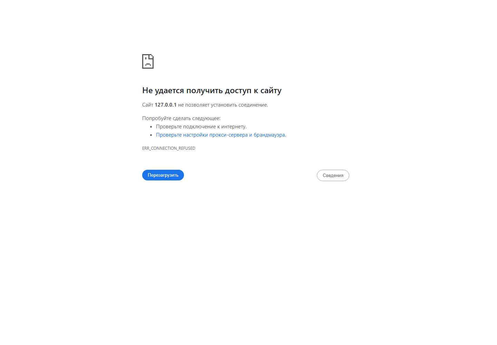

# Recipe Library

Recipe Library is now a fullstack React application with a real Express API, MongoDB database, JWT authentication, and CRUD operations for recipes.

## Stack

- React 19
- React Router v6
- Context API
- Custom hooks
- Express
- MongoDB with Mongoose
- JWT authentication

## Features

- User registration and login
- Protected routes
- Persistent auth session with token revalidation
- Public recipe listing
- Create, edit, and delete your own recipes
- Search, filter, and sorting
- Favorites persistence
- Loading, error, empty, and success states
- Settings page for API error simulation and recipe reseeding

## Screenshots



## Project Structure

```text
frontend/
  public/
  src/
    components/
    context/
    hooks/
    pages/
    services/
    utils/

backend/
  src/
    config/
    data/
    middleware/
    models/
    routes/
    utils/
```

## Environment

The project uses separate environment files for frontend and backend.

`backend/.env`:

```env
PORT=5000
CLIENT_URL=http://localhost:3000
MONGODB_URI=mongodb://127.0.0.1:27017/recipe-library
JWT_SECRET=recipe-library-super-secret-key-change-me
```

`frontend/.env`:

```env
REACT_APP_API_URL=http://localhost:5000/api
```

## Run the Project

1. Install dependencies:

```bash
npm install
```

2. Start MongoDB locally.
3. Start the backend:

```bash
npm run server
```

4. In another terminal, start the frontend:

```bash
npm run client
```

## Available Scripts

- `npm start` - start the React frontend
- `npm run client` - start the React frontend
- `npm run server` - start the Express backend
- `npm run build` - production build
- `npm test` - run tests
- `npm run format` - format source files with Prettier
- `npm run format:check` - verify formatting

## API Routes

- `POST /api/auth/register`
- `POST /api/auth/login`
- `GET /api/auth/me`
- `GET /api/recipes`
- `POST /api/recipes`
- `PUT /api/recipes/:recipeId`
- `DELETE /api/recipes/:recipeId`
- `POST /api/recipes/seed`

## Architecture Notes

- Context API is the main state-management solution because the app has a few clear global concerns rather than one very large event-driven store.
- `AuthContext`, `RecipesContext`, `ThemeContext`, and `FeedbackContext` keep authentication, recipe data, theme, and user feedback separate.
- API calls live in `frontend/src/services`, so components do not contain fetch logic.
- `useLocalStorage` handles persisted state rehydration for auth, filters, favorites, theme, and error simulation settings.
- `useDebounce`, `useMemo`, `useReducer`, `useRef`, `useCallback`, and effect cleanup are used for search, derived data, form focus, feedback timing, and stable context actions.
- The backend exposes real REST routes with Express and persists users/recipes in MongoDB through Mongoose.

## Endterm Checklist

- Clear folders: `components`, `pages`, `hooks`, `services`, `utils`
- Minimum 5 routes, nested `/recipes/*` routes, dynamic `:recipeId`, protected routes, and custom 404 page
- Context API with separated contexts
- Real API integration with `fetch`, async/await, service layer, loading/error/empty states, and CRUD
- localStorage persistence with rehydration
- Responsive UI, validation messages, loading indicators, and success/error feedback
- PropTypes validation for reusable components
- Prettier formatting scripts

## Verified

- Frontend production build passes
- Frontend test passes
- Backend health endpoint responds
- Real registration/login flow works
- Real recipe create/delete flow works
